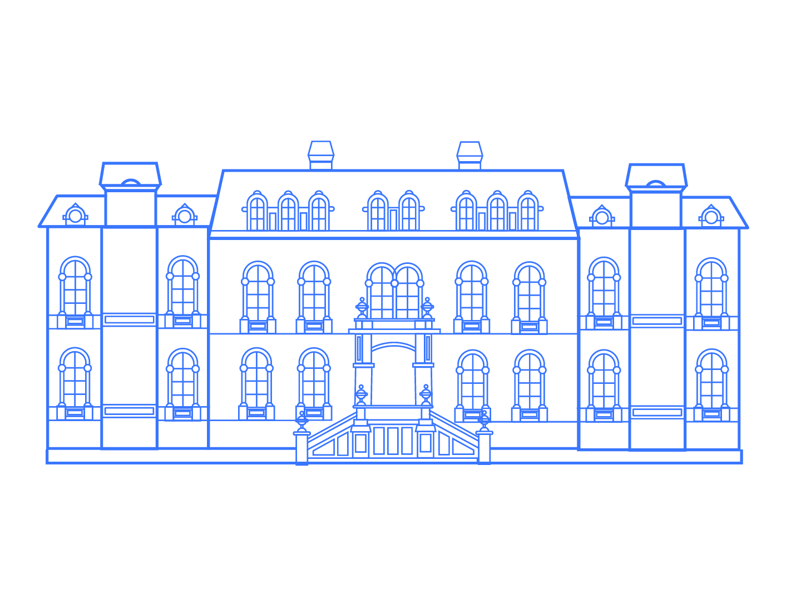
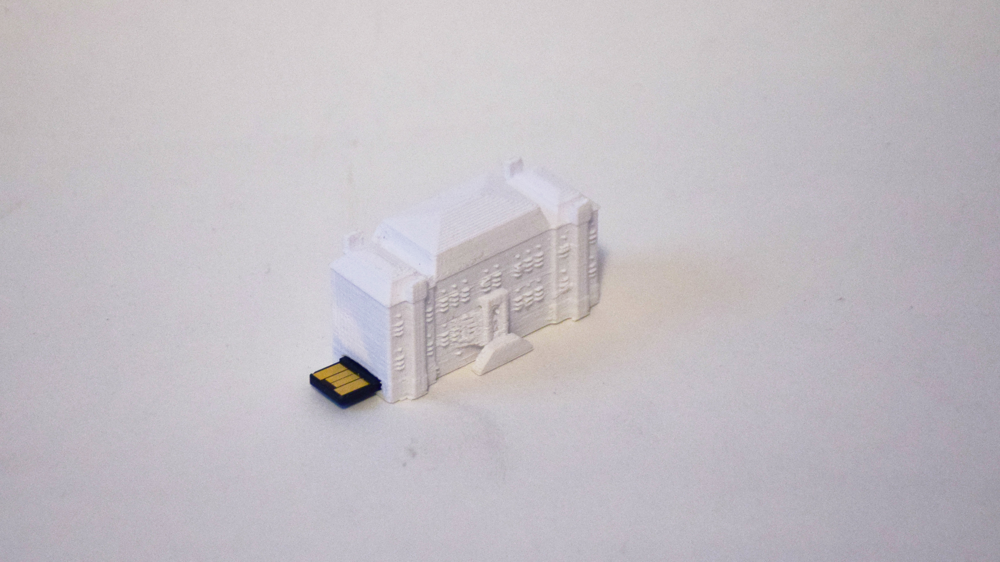

# I School Illustrations

To the extent possible under law, [Soravis Prakkamakul](https://soravis.com) has waived all copyright and related or neighboring rights to I School Illustrations.

A collection of vectors and a 3d model related to Berkeley I School. 

## South Hall Line Illustration

## Campanile Line Illustration

## Littlest Bear Facade

## 3D Printed South Hall

The model could be printed with Jacob Hall's Type A 3D Printer. Consult Jacob Institute design specialists for more details.

